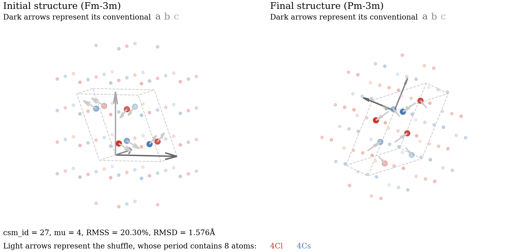

# Tutorial

!!! abstract

    A solid-solid phase transition establishes an **atom-to-atom correspondence** between the initial and final crystal structures $\mathcal A$ and $\mathcal B$. Such correspondence is called a **crystal-structure match (CSM)**. A CSM can be described by a pair of [POSCAR](https://www.vasp.at/wiki/index.php/POSCAR) files, which specifies how the lattice deforms from $\mathcal A$ to $\mathcal B$ and the correspondence between atoms in a supercell of $\mathcal A$ and those in $\mathcal B$.

    The main functions of `crystmatch` are as follows:

    - **Enumeration**:
        - Provide a complete list of **representative** CSMs between $\mathcal A$ and $\mathcal B$, with user-specified upper bounds on the **multiplicity** and **strain**.
        - Provide a complete list of CSMs with user-specified upper bounds on the **multiplicity**, **strain**, and **shuffle distance**.

    - **Analysis**:
        - Read a CSM from a pair of POSCAR files, and save CSMs in the same format.
        - Calculate the root-mean-squared strain (RMSS), estimated strain energy density, and shuffle distance (RMSD) for each CSM.
        - Benchmark each CSM by its deviation angle from a given orientation relationship.
        - Visualize the distribution of strain, shuffle distance, and multiplicity of CSMs in a 2D scatter plot.
        - Visualize a CSM in a 3D interactive plot.
    
    Congruent CSMs (those differ only by a space-group transformation) are identified and excluded from the enumeration using the **[Spglib](https://spglib.readthedocs.io/en/stable/python-interface.html)** library by [Atsushi Togo *et al.*](https://www.tandfonline.com/doi/full/10.1080/27660400.2024.2384822)

## Installation

Make sure you have **Python 3.9 or later** installed. You can check it by running:

```
python3 --version
```

To install the latest version of `crystmatch`, run:

```
pip3 install --upgrade crystmatch
```


Check whether `crystmatch` is successfully installed:

```
crystmatch --version
```

!!! tip
    If you prefer using `conda`, you can install `crystmatch` by running:
    ```
    conda install -c conda-forge crystmatch
    ```
    and update it by running:
    ```
    conda update -c conda-forge crystmatch
    ```

## How to cite

If you use `crystmatch` in your research, please cite one of the following paper:

- **[Crystal-Structure Matches in Solid-Solid Phase Transitions](https://arxiv.org/abs/2305.05278)**

    *Physical Review Letters* **132**, 086101 (2024)

    ```
    @article{wang2024crystal,
        title={Crystal-Structure Matches in Solid-Solid Phase Transitions},
        author={Wang, Fang-Cheng and Ye, Qi-Jun and Zhu, Yu-Cheng and Li, Xin-Zheng},
        journal={Phys. Rev. Lett.},
        volume={132},
        number={8},
        pages={086101},
        year={2024},
        publisher={APS},
        doi={10.1103/PhysRevLett.132.086101}
    }
    ```

- **[Classification and Enumeration of Solid-Solid Phase Transition Mechanisms](https://arxiv.org/abs/2506.05105)**

    *Under review* (2025)

    ```
    @article{wang2025classification,
        title={Classification and Enumeration of Solid-Solid Phase Transition Mechanisms},
        author={Wang, Fang-Cheng and Ye, Qi-Jun and Zhu, Yu-Cheng and Li, Xin-Zheng},
        journal={arXiv:2506.05105},
        year={2025},
        doi={10.48550/arXiv.2506.05105}
    }
    ```

## Usage

To run `crystmatch`, one of the following modes must be selected:

1. **`--enumerate`**
    
    Enumerate a list of representative CSMs, save them to a `CSMLIST.npz` file, and perform preliminary analysis. The initial and final crystal structures must be specified in two separate [POSCAR](https://www.vasp.at/wiki/index.php/POSCAR) files.

2. **`--read`**
    
    Read CSMs from a `CSMLIST.npz` file. You can export specific CSMs to POSCARs or XDATCARs, perform orientation-relationship analysis, and visualize them interactively.

3. **`--direct`**
    
    Directly determine a single CSM by two POSCAR files (must have the same number of atoms) and perform detailed analysis.

**We strongly recommend starting with the [examples](#examples) provided below, and then see [all available options](https://fangcheng-wang.github.io/crystmatch/cli/).** To see the help message, run:

```
crystmatch --help
```

## Examples

### Enumerating representative CSMs

To enumerate a list of representative CSMs (*each having the minimal shuffle distance among all CSMs with the same deformation*) between two crystal structures given by POSCAR files `Graphite` and `Diamond`, with upper bounds `MAX_MU = 2` for multiplicity and `MAX_STRAIN = 0.4` for RMSS, run:

```
crystmatch --enumerate Graphite Diamond 2 0.4
```

!!! warning "Caveat"
    We recommend you to try `MAX_MU = 2` and `MAX_W = 0.4` first, and then gradually adjust these upper bounds, usually by increasing `MAX_MU` and decreasing `MAX_W`, to obtain desired results. Otherwise, the enumeration may take a very long time, or find no CSMs at all.

!!! note "Suggestion"
    If you are using a job scheduling system such as SLURM on a remote server, you can redirect the output of `crystmatch` to a log file and monitor the progress in real time using:

    ```
    crystmatch --enumerate Graphite Diamond 2 0.4 > log
    ```

The following files will be created in the current directory:

```powershell
./
├── CSMLIST-m2s0.4.npz       # stores the enumerated CSMs and metadata
├── SUMMARY-m2s0.4.csv       # lists the multiplicity, RMSS, and RMSD
└── SCATTER-m2s0.4.pdf       # shows the RMSD-RMSS distribution of the CSMs
```

Here, `CSMLIST-m2s0.4.npz` contains all information of the enumerated CSMs and SLMs, but is not intended to be human-readable. `SUMMARY-m2s0.4.csv` look like this:

```python
# ./SUMMARY-m2s0.4.csv

# csm_id,  slm_id,      mu,  period,  rmss/%,  rmsd/Å
       0,       0,       1,       4,   21.28,  0.4788
       1,       1,       1,       4,   26.20,  0.6833
       2,       2,       1,       4,   30.47,  0.4884
       3,       3,       1,       4,   36.85,  0.7826
       4,       4,       1,       4,   37.89,  0.5036
       5,       5,       1,       4,   39.79,  0.7856
       6,       6,       2,       8,   14.34,  0.9107
       7,       7,       2,       8,   19.50,  0.8152
```

`SCATTER-m2s0.4.pdf` visualizes the RMSD-RMSS-multiplicity distribution of the CSMs.

### Enumerating all CSMs

To enumerate all CSMs (*representative and nonrepresentative*) between two crystal structures given by POSCAR files `Graphite` and `Diamond`, with upper bounds `MAX_MU = 2` for multiplicity, `MAX_STRAIN = 0.4` for RMSS, and `MAX_D = 1.8` for RMSD, run:

```
crystmatch --enumerate Graphite Diamond 2 0.4 --all 1.8
```

The following files will be created in the current directory:

```powershell
./
├── CSMLIST-m2s0.4d1.8.npz     # stores the enumerated CSMs and metadata
├── SUMMARY-m2s0.4d1.8.csv     # lists the multiplicity, RMSS, and RMSD
└── SCATTER-m2s0.4d1.8.pdf     # shows the RMSD-RMSS distribution of the CSMs
```

!!! warning "Caveat"
    Using `--all MAX_D` with large `MAX_MU` may result in a very large number of CSMs. We recommend you to try `MAX_D = 1.2` first, and then gradually increase it to obtain desired results.

If you wish to apply weighting to atomic species when calculating RMSD, prepare a CSMCAR file and use the `--extra` option. See [CSMCAR](https://fangcheng-wang.github.io/crystmatch/cli/#atomic-weights) for details.

### Visualizing CSMs in a 3D interactive plot

If you are using `crystmatch` in a local terminal, you can visualize the CSMs in a **3D interactive plot** by adding the `--interact` option, as shown below. You can rotate and zoom the plot using your mouse or touchpad.



However, using `--interact` in `--enumerate` mode might be unwise, as you would have to visually inspect numerous CSMs one by one. The recommended workflow is:

1. Perform [enumeration](#enumerating-representative-csms), generating `SCATTER.pdf`, `SUMMARY.csv`, and `CSMLIST.npz`.
2. See `SCATTER.pdf` and roughly note the RMSS and RMSD values of CSMs of interest.
3. Identify the corresponding `csm_id` values for these CSMs in `SUMMARY.csv`, e.g., `0`, `7`, `112`.
4. Read and visualize these CSMs from `CSMLIST.npz` using the following command:

```
crystmatch --read CSMLIST.npz 0 7 112 --interact
```

!!! note "Suggestion"
    You can enumerate CSMs on a remote server or WSL, and then download the `CSMLIST.npz` file to your local machine so that the CSMs can be visualized interactively using `--interact`.

### Exporting CSMs as POSCAR or XDATCAR files

To export CSMs with `csm_id` values `7` and `10` from `CSMLIST.npz` as POSCAR files, run:

```
crystmatch --read CSMLIST.npz 7 10 --poscar
```

Two folders will be created in `./EXPORT-read/`, each containing a pair of POSCAR files representing the CSM:

```
./EXPORT-read/
├── CSM_7/
│   ├── POSCAR_I
│   └── POSCAR_F
└── CSM_10/
    ├── POSCAR_I
    └── POSCAR_F
```

You can also export CSMs as XDATCAR files using the `--xdatcar` option. Both `--poscar` and `--xdatcar` are also available in `--enumerate` and `--direct` modes.

### Identifying CSM from a pair of POSCAR files

To identify and analyze the CSM defined by a pair of POSCAR files `POSCAR_I` and `POSCAR_F`, run:

```
crystmatch --direct POSCAR_I POSCAR_F
```

To enumerate all CSMs with identical initial and final supercells as `POSCAR_I` and `POSCAR_F`, but different atomic correspondences, run:

```
crystmatch --direct POSCAR_I POSCAR_F --all MAX_D
```

Here, `MAX_D` should be set to a smaller value if the supercells contain many atoms.

### Orientation-relationship analysis

In `--enumerate`, `--read`, and even `--direct` modes, you can perform orientation-relationship analysis by using `--orientation ASSUM` and `--extra CSMCAR`. See [CSMCAR](https://fangcheng-wang.github.io/crystmatch/cli/#orientation-relationship) for details.

### Computing estimated strain energy density

If you want to use the estimated strain energy density, rather than the RMSS, to quantify the strain, you should provide the elastic tensors of the initial and final structures in the [CSMCAR](https://fangcheng-wang.github.io/crystmatch/cli/#elastic-tensors) file.
